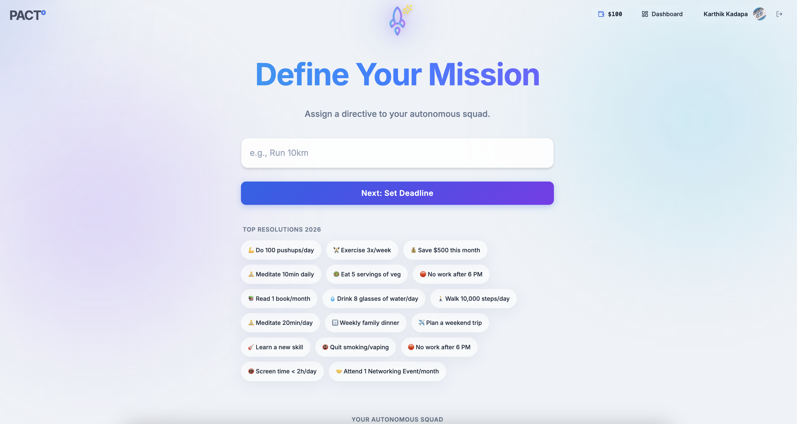
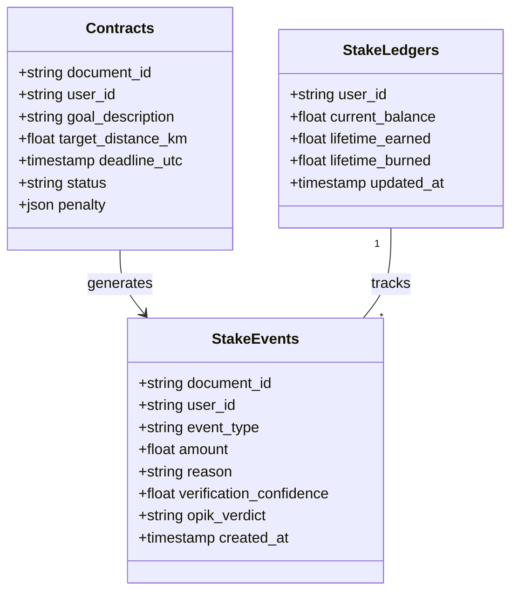

# PACT⁰ (Pact Zero)


> **Commitments earned through proof, not promises.**

PACT⁰ is an autonomous multi-agent system that turns resolutions into living commitments. Instead of relying on willpower, PACT uses AI agents to verify real-world proof signals (Strava data), detect cheating patterns, and enforce consequences when commitments are broken.

Built for the **AI Agents Hackathon**, this MVP demonstrates a "zero-motivation" model where commitments are managed by code, not conscience.

## 🤖 The 4-Agent Architecture

PACT uses a specialized team of agents to manage the lifecycle of a commitment:

1.  **Contract Agent** (LLM-powered)
    *   **Role**: Translates natural language goals into machine-verifiable JSON contracts.
    *   *Input*: "I want to run 5k by Sunday."
    *   *Output*: Strict JSON schema with deadlines, distance targets, and defined penalties.

2.  **Verify Agent** (Deterministic Logic)
    *   **Role**: VALIDITY CHECK. Analyzes raw activity data (GPS, time, heart rate).
    *   **Checks**:
        *   Did the run happen before the deadline?
        *   Is the distance sufficient (within tolerance)?
        *   **Anti-Cheat**: Analyzes Heart Rate variability to detect "treadmill cheating" (running on a belt without physical exertion).

3.  **Detect Agent** (Safety & Observability)
    *   **Role**: SAFETY CHECK. Acts as the "Supreme Court".
    *   **Logic**:
        *   Prevents enforcement if verification is uncertain.
        *   Checks system reliability (False Positive Rate).
        *   Ensures penalties remain within safety limits.

4.  **Adapt Agent** (Enforcement)
    *   **Role**: EXECUTION. Carries out the consequences.
    *   **Actions**:
        *   Executes Stripe donations (Mocked/Test Mode).
        *   Logs public shame events.
        *   Adapts strictness for future contracts (Roadmap).

## 📊 Evaluation & Observability

We use **Opik** to systematically evaluate our agents and monitor production behavior.

### 1. Offline Evaluation (Experiments)
We have implemented a rigorous evaluation pipeline (`src/evaluate.py`) that tests the **Contract Agent** against a gold-standard dataset of 17 diverse user goals (e.g., "Do 100 pushups", "Read a book").
*   **Dataset:** `PACT_NewYear_Goals_v1` (Managed in Opik)
*   **Metric:** JSON Validity & Schema Compliance
*   **Experiment:** `Contract_Agent_Baseline`

**Run the evaluation yourself:**
```bash
python src/evaluate.py
```

### 2. Online Monitoring (Traces)
Every interaction is traced in Opik:
*   **Traces**: detailed waterfalls of agent reasoning (Negotiation -> Verification -> Audit).
*   **Metrics**: Custom metrics like `detect_verdict` track how often the "Supreme Court" agent blocks enforcement.

## 🛠 Tech Stack

*   **Language**: Python 3.10+
*   **LLM**: Google Gemini 2.0 Flash (via `google-generativeai`)
*   **Observability**: [Opik](https://comet.com/opik) (Trace logging, Metrics, Evaluation)
*   **Data Source**: Strava (Mocked for deterministic demos)
*   **Orchestration**: Custom functional chain (LangGraph-ready)

## 🚀 Getting Started

### Prerequisites
*   Python 3.10+
*   Google Cloud API Key (for Gemini)
*   Opik API Key (for observability)

### Installation

1.  Clone the repo:
    ```bash
    git clone https://github.com/yourusername/pact-zero.git
    cd pact-zero
    ```

2.  Create virtual environment:
    ```bash
    python3 -m venv venv
    source venv/bin/activate
    ```

3.  Install dependencies:
    ```bash
    pip install -r requirements.txt
    ```

4.  Configure Environment:
    Create a `.env` file:
    ```ini
    GOOGLE_API_KEY=your_gemini_key_here
    OPIK_API_KEY=your_opik_key_here
    OPIK_PROJECT_NAME=pact-demo
    ```

## 🎮 Running the Demo

The project includes a CLI to simulate various user scenarios without needing a real Strava account or GPS watch.

**1. The Happy Path (Success)**
User meets their goal. Verification passes.
```bash
python -m src.main --scenario happy
```

**2. The Cheater (Anti-Cheat Demo)**
User logs a treadmill run but the Heart Rate data is flat/inconsistent.
```bash
python -m src.main --scenario cheat_treadmill
```
*Result*: Verification fails, Detect Agent authorizes enforcement, Adapt Agent charges penalty.

**3. Late Submission**
User misses the deadline.
```bash
python -m src.main --scenario late
```

**4. Short Run**
User stops before hitting the target distance.
```bash
python -m src.main --scenario short
```

## 📊 Observability

This project is deeply integrated with **Opik**. Every agent interaction, LLM call, and logic decision is traced.
*   **Traces**: See exactly why a run failed verification.
*   **Metrics**: Track "Verification Confidence" and "Enforcement Count".

## 📂 Project Structure

```
src/
├── agents/
│   ├── contract.py   # LLM Goal Parsing
│   ├── verify.py     # Data Validation
│   ├── detect.py     # Safety Integration
│   └── adapt.py      # Consequence Execution
├── core/
│   ├── orchestrator.py  # Agent Workflow
│   └── schemas.py       # Shared Data Models
└── utils/
    ├── strava_mock.py   # Deterministic Data Generator
    └── opik_utils.py    # Logging Wrappers
```

## 💾 Backend Data Schema (Firestore)



---
*Created for the AI Agents Hackathon by Nathan Drake & The PACT Team.*
