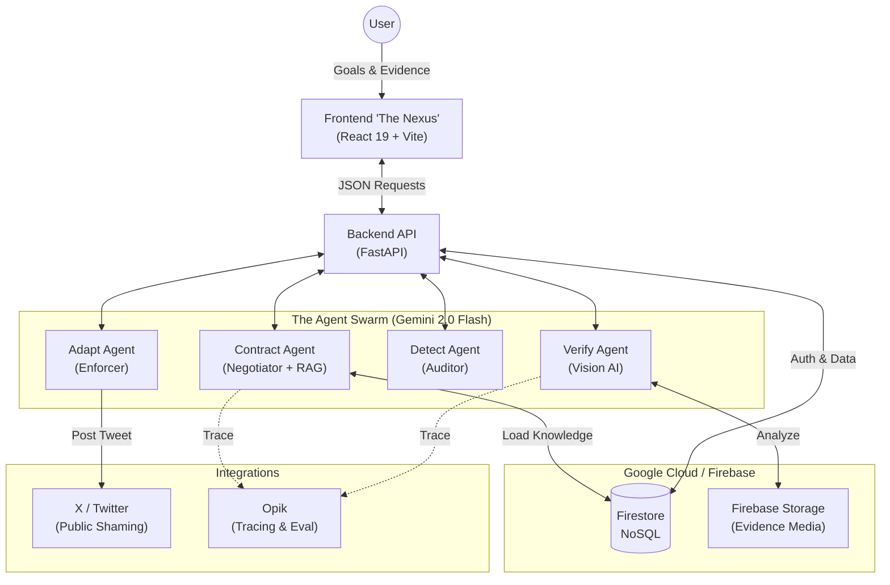

# PACT⁰ (Proof-Activated Commitment Tracker)


> **Commitments earned through proof, not promises.**
>
> 🌐 **Project Documentation Website**: [pact.github.io](https://kkadapa.github.io/PACT/)

**PACT⁰ (Proof-Activated Commitment Tracker)** is an autonomous multi-agent system that turns resolutions into living commitments. Unlike traditional habit trackers, PACT relies on **financial stakes**, **social pressure**, and **AI verification**.

Use the **Contract Agent** to negotiate a binding agreement, verify your progress with **multi-modal evidence** (text, photos, Strava data), and prove your integrity to the community on **The Buzz**.

---

## 🌟 Key Features

### 🤖 The 4-Agent Architecture
A specialized team of agents manages the lifecycle of every commitment:
1.  **Contract Agent**: Translates natural language goals (e.g., "Run 5k," "Clean my room") into machine-verifiable JSON contracts.
2.  **Verify Agent**: The "Detector". Analyzes evidence—whether it's GPS data from Strava or a photo of your clean room—to validate success.
3.  **Detect Agent**: The "Supreme Court". Monitors the system for fairness, preventing false positives and ensuring safe enforcement.
4.  **Adapt Agent**: The Enforcer. Executes consequences (charity donations, public shaming) when commitments are broken.

### 🏗 Architecture



### 📸 Universal Verification
PACT isn't just for running.
*   **Fitness**: Verify runs, rides, and swims via Strava integration.
*   **Real World Tasks**: Upload a photo evidence (e.g., "Read 10 pages," "Water the plants") and let our Vision AI verify it.
*   **Text/Journaling**: Submit text updates for semantic analysis.

### 🐝 Social & Gamification
Accountability is better together.
*   **The Buzz**: A live feed of verified commitments. See what others are achieving in real-time.
*   **Trust Score**: A dynamic reputation score based on your completion rate. High trust unlocks exclusive perks.
*   **Leaderboard**: Compete with others to become the most trustworthy user on the platform.

### 💸 Financial Stakes
Put your money where your mouth is.
*   **Escrow**: Stakes are held securely until the deadline.
*   **Consequences**: Fail your pact, and your money is donated to charity (or an "anti-charity" to really motivate you).

---

## 🏆 Why PACT? (Hackathon Criteria)

### 💡 Novelty
Traditional habit trackers are passive input forms. **PACT is Agentic.** It negotiates with you, audits your evidence like a lawyer, and enforces consequences without bias. It turns *intent* into *binding contract* using a multi-agent system that mimics real-world accountability partners.

### 🛠 Tech Implementation & AI
We utilize a cutting-edge **Multi-Agent Architecture**:
*   **Agentic RAG**: The *Contract Agent* retrieves "Standard Terms" from a knowledge base to ensure your goals are measurable and fair (e.g., pulling standard marathon pacing rules).
*   **Vision AI**: The *Verify Agent* uses Gemini 1.5 Flash to analyze photo evidence (e.g., verifying a gym selfie contains equipment).
*   **System 2 Thinking**: The *Detect Agent* acts as a Supreme Court, auditing the verifier's decision before money is moved.

### 🌍 Impact
Procrastination and lack of follow-through cost individuals health, wealth, and happiness. PACT provides the **forcing function** needed to bridge the gap between "I should" and "I did." By automating accountability, we make high-performance habits accessible to everyone.

### 💰 Viability (Business Model)
*   **Transaction Fees**: 1% fee on staked amounts.
*   **Enterprise API**: "PACT for Teams" allows companies to automate employee wellness and productivity goals.
*   **Insurance**: "Goal Insurance" where users can pay a premium to protect their stake in case of documented emergencies.

---

## 🛠 Tech Stack

### Frontend ("The Nexus")
*   **Framework**: React 19 + Vite
*   **Styling**: Tailwind CSS v4 + Framer Motion
*   **Infrastructure**: Firebase Auth & Firestore

### Backend ("The Core")
*   **API**: Python FastAPI
*   **LLM**: Google Gemini 2.0 Flash (via `google-generativeai`)
*   **Orchestration**: Custom Agent Workflow
*   **Database**: Google Cloud Firestore (NoSQL)
*   **Storage**: Firebase Storage (Image Evidence)

### Observability
*   **Platform**: **[Opik by Comet](https://comet.com/opik)**
*   **Features**: Full waterfall tracing of agent reasoning, automated evaluation metrics, and production monitoring.

---

## 🚀 Getting Started

### Prerequisites
*   Node.js 18+
*   Python 3.10+
*   Google Cloud Project (for Firebase & Gemini)
*   Opik Account (optional, for tracing)

### 1. Backend Setup

1.  **Clone and Enter Directory**:
    ```bash
    git clone https://github.com/yourusername/pact-zero.git
    cd pact-zero
    ```

2.  **Virtual Environment**:
    ```bash
    python3 -m venv venv
    source venv/bin/activate
    pip install -r requirements.txt
    ```

3.  **Environment Variables**:
    Create a `.env` file in the root directory:
    ```ini
    GOOGLE_API_KEY=your_gemini_key
    OPIK_API_KEY=your_opik_key
    OPIK_PROJECT_NAME=pact-demo
    # Firebase Service Account (Base64 encoded) or path to serviceAccountKey.json
    FIREBASE_SERVICE_ACCOUNT_BASE64=... 
    ```

4.  **Run the API**:
    ```bash
    fastapi dev src/api.py
    ```
    The backend will start at `http://127.0.0.1:8000`.

### 2. Frontend Setup

1.  **Navigate to UI**:
    ```bash
    cd pact-ui
    ```

2.  **Install Dependencies**:
    ```bash
    npm install
    ```

3.  **Run Development Server**:
    ```bash
    npm run dev
    ```
    The frontend will launch at `http://localhost:5173`.

---

## 📚 API Reference

| Endpoint | Method | Description |
| :--- | :--- | :--- |
| `/negotiate` | `POST` | Turn a goal string into a strict JSON contract. |
| `/commit` | `POST` | Sign a contract and save it to the database. |
| `/verify` | `POST` | Validate evidence (Activity ID, Image, or Text) against a contract. |
| `/feed` | `GET` | Get the latest stream of public verification events. |
| `/leaderboard` | `GET` | Get top users ranked by Trust Score. |
| `/upload_evidence`| `POST` | Upload generic evidence (images) for verification. |

---

## 📊 Evaluation

We treat our prompts as code. Run our automated evaluation pipeline to test the **Contract Agent** against a gold-standard dataset of user goals.

```bash
python src/evaluate.py
```
*metric: `IsJson` (Schema Compliance)*

---

*Created for the AI Agents Hackathon by Nathan Drake & The PACT Team.*
